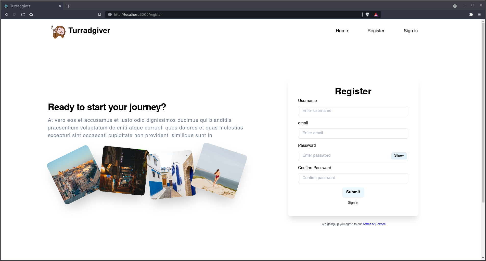
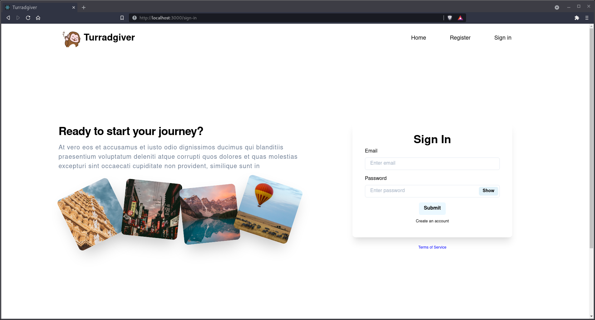

# Turradgiver [frontend]

## What is the goal of that project ?

This project has been implemented during a course of web services in ISIMA Engineer school.

The goal of this project is to build a website similar to Tripadvisor using ASP.net for the backend and React for the frontend.  
This repository contain all the frontend implementation using React.
For the backend built using dotnet see the following repository: [zz2_ws_backend](https://github.com/easy-ma/zz2_ws_backend)

The authors of this project are :

- [Babidiii](https://github.com/Babidiii)
- [BasileNq](https://github.com/BasileNq)
- [Khaaz](https://github.com/Khaaz)
- [xerstom](https://github.com/xerstom)

## Preview

## Lint

https://commitlint.js.org/#/
